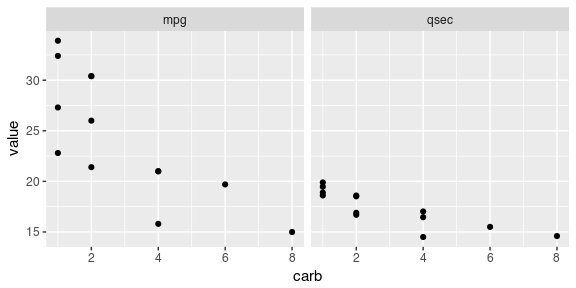

Template for analysis in R
================
YOU
TODAY

-   [Analysis summary](#analysis-summary)
-   [Import libraries](#import-libraries)
-   [Import data](#import-data)
-   [Transform data](#transform-data)
-   [Plot data](#plot-data)

Analysis summary
----------------

This is an example outline of how we analyze data in our lab.

Import libraries
----------------

``` r
library(stringr)
library(tidyverse)
```

Import data
-----------

``` r
data <- read_csv("https://github.com/tidyverse/readr/raw/master/inst/extdata/mtcars.csv") %>% 
  print()
```

    ## # A tibble: 32 x 11
    ##      mpg   cyl  disp    hp  drat    wt  qsec    vs    am  gear  carb
    ##    <dbl> <int> <dbl> <int> <dbl> <dbl> <dbl> <int> <int> <int> <int>
    ##  1  21.0     6  160.   110  3.90  2.62  16.5     0     1     4     4
    ##  2  21.0     6  160.   110  3.90  2.88  17.0     0     1     4     4
    ##  3  22.8     4  108.    93  3.85  2.32  18.6     1     1     4     1
    ##  4  21.4     6  258.   110  3.08  3.22  19.4     1     0     3     1
    ##  5  18.7     8  360.   175  3.15  3.44  17.0     0     0     3     2
    ##  6  18.1     6  225.   105  2.76  3.46  20.2     1     0     3     1
    ##  7  14.3     8  360.   245  3.21  3.57  15.8     0     0     3     4
    ##  8  24.4     4  147.    62  3.69  3.19  20.0     1     0     4     2
    ##  9  22.8     4  141.    95  3.92  3.15  22.9     1     0     4     2
    ## 10  19.2     6  168.   123  3.92  3.44  18.3     1     0     4     4
    ## # ... with 22 more rows

Transform data
--------------

``` r
processed_data <- data %>% 
  filter(am == 1) %>%
  select(mpg, qsec, carb)

processed_data %>% 
  knitr::kable()
```

|   mpg|   qsec|  carb|
|-----:|------:|-----:|
|  21.0|  16.46|     4|
|  21.0|  17.02|     4|
|  22.8|  18.61|     1|
|  32.4|  19.47|     1|
|  30.4|  18.52|     2|
|  33.9|  19.90|     1|
|  27.3|  18.90|     1|
|  26.0|  16.70|     2|
|  30.4|  16.90|     2|
|  15.8|  14.50|     4|
|  19.7|  15.50|     6|
|  15.0|  14.60|     8|
|  21.4|  18.60|     2|

Plot data
---------

``` r
processed_data %>% 
  gather(statistic, value, -carb) %>% 
  ggplot(aes(x = carb, y = value)) +
  facet_wrap(~ statistic, ncol = 2) +
  geom_jitter(width = 0)
```


